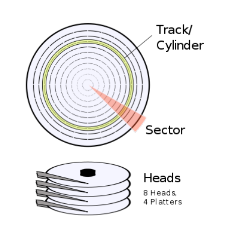

# A little summary on disk formats

## Physical Disk Architecture

Traditional disks contain one or more platters (the magnetic disc that actually has the data), the original way to read such disks is CHS addressing which stands for "Cylinder, Head, Sector". That's because you have:
1. A head: A small device on an actuator arm that is put on the platter to read from and write to it.
2. A sector: A segment of the platter that looks like a slice of pizza.
3. A cylinder (also called a ***track*** sometimes!): A circular segment of the platter.

Example image:

To read a disk with CHS addressing linearly, you would traverse from start to end with the following steps:
- Start reading the sectors on cylinder 0, head 0, starting from ***sector 1*** till you finish all sectors there
- Then you move onto the next head and start reading sectors from it, and repeat until you run out of heads
- Then you move inwards onto another cylinder.

Modern disks use LBA addressing (Logical Block Addressing) which relies solely on linear indexing starting from ***sector 0***, the disk itself handles physical details.

As a software developer, on a modern disk you only care about the amount of sectors on it and the size of each sector, the most common sector size today is 4096-bytes, but it used to be 512-bytes (and many 4096-byte disks show themselves as 512-byte for compatibility).

There is also a disk segmentation unit called a cluster, but clusters are a software concept specific to each file system on disk partitions and are not part of the actual hardware.

I'm not going to talk much about the hardware prespective of disks however, the main focus is how the data is layed out inside.

## Disk Partitioning Formats

There are really only two disk formats that are used in our daily lives: MBR and GPT (not the AI chatbot):

The first is MBR (Master Boot Record): This is the older format, it contains a fixed-size table of four entries for disk partitions, therefore a maximum of four partitions for a disk, though you could extend the limit by using an Extended Partition, which contains other partitions:

- On an MBR formatted disk, the first sector is supposed to contain 512-bytes of specific data (even if the sector is larger than 512-bytes): 446 bytes of machine code ready to get started by the BIOS, the 64-byte partition table of four 16-byte entries, and the 2-byte boot signature 0xAA55 ({55, AA} in low endian memory). When you start the computer, the BIOS runs the code at the start of the MBR (the first sector, not the disk format, MBR can mean both) and gives it control over the computer.

- Bootloaders must then load a secondary stage of machine code as 446 isn't enough to really do much. A bootloader may load from a binary written on disk right after the MBR before any partition, or from other specific hardcoded sectors.

 

The second format is GPT: The newer, better format, and as you may expect, more complex. GPT stands for "GUID Partition Table", on a GPT system:

- The first sector also contains the MBR, this one is called the GPT Protective MBR, it must have a single partition with specific data to signify a fully partitioned and reserved disk using the GPT format. You can use GPT on a BIOS system but it's practically intended for modern UEFI environments. You can also use MBR on a UEFI system but some operating systems and firmware may not let you do so.

- On the second sector (sector number 1 in LBA) comes the Primary GPT Header, a 92-byte structure containing details about itself and the partition entries

- Then starting at the third sector is the GPT Partition Entry Array, the common standard is 128 entries but it can contain any amount of entries you want. For booting on UEFI, you need an ESP partition (EFI System Partition) which contains a FAT32 file system and bootloader files, you usually also need another partition for your operating system.

- At the last sector of the disk there must be a Backup GPT Header, which is a copy of the Primary GPT Header at the last sector, with the same GUID but a few data fields flipped the other way around. At the sectors right below the Backup Header is the Backup GPT Partition Entry Array which is an exact 1:1 copy of the original Partition Entry Array.

- Other sectors are free to use and partition however you like. On both formats, you should skip a few sectors at the beginning for ideal alignment before your partitions, the commonly used alignment value is 1MiB.

- The UEFI specification requires that you set the excess bytes in the sectors of the GPT header and the Partition Entry Array to zero. You must also set unused partition entries to zero as it is necessary for the CRC32 checksum (a number in the GPT Header) to be properly calculated.
